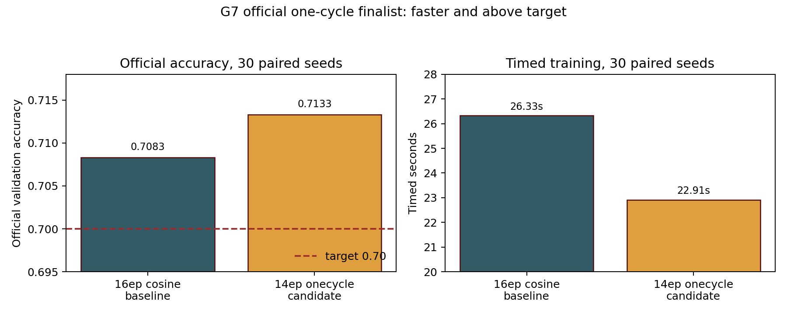

# E01 One-Cycle Schedule Beats the Official CIFAR-100 Baseline

> [!summary] TL;DR
> **One-cycle training** preserves the CIFAR-100 official target while removing two timed epochs. It reaches ==0.7133== mean official validation accuracy and cuts timed training to `87.1%` of the 16-epoch cosine baseline; the claim is scoped to this fixed official speedrun contract.

## Setup

> [!info] Constraints
> - Dataset: CIFAR-100 with the official train split for training and the official test split as the challenge's fixed plain validation target.
> - Hardware: one Leonardo `NVIDIA A100-SXM-64GB`.
> - Scale: 30 paired seeds, base seed `880000`, alternating baseline/candidate order.
> - Metric: official validation accuracy must exceed `0.70`; timed training seconds should be lower than the baseline.

The run tested whether a 14-epoch one-cycle schedule can replace the repository's 16-epoch cosine baseline without losing the official validation target. The baseline is the default SimpleResNet/Muon configuration with 16 epochs and cosine scheduling. The candidate changes only the schedule and epoch count: `C100_EPOCHS=14`, `C100_LR_SCHEDULE=onecycle`, `C100_ONECYCLE_PCT_UP=0.30`, and `C100_ONECYCLE_DIV_FACTOR=10.0`.

The decision criterion was strict: the job had to complete cleanly, use record mode with official validation, preserve 30 paired seeds, keep every candidate run inside the declared configuration, exceed `0.70` mean official validation accuracy, and beat the baseline on mean paired timed seconds.

---

## Result

| Metric | Candidate | Baseline | Delta / ratio |
| --- | :---: | :---: | :---: |
| Mean official validation accuracy | **0.713300** | `0.708300` | `+0.005000` |
| Minimum official validation accuracy | **0.708600** | `0.701800` | n/a |
| Target hits | **30/30** | `30/30` | n/a |
| Mean timed seconds | **22.911267** | `26.326719` | `-3.415452s` |
| Mean time ratio | **0.870868** | n/a | n/a |

---

## Findings

### Schedule compression is enough for a first official win

> [!important]
> The 14-epoch one-cycle candidate is both faster and more accurate on the 30-seed official paired comparison.

The candidate was faster on every pair. Accuracy delta was positive on `27/30` pairs and negative on `3/30`, but the mean official validation accuracy still improved by `+0.005000`. The minimum candidate official validation accuracy was `0.708600`, so no candidate seed fell below the challenge target.

### The validation and timing surfaces stayed fixed

The launch log printed the official split files before training: `cifar100/train.pt` contained 50,000 images and `cifar100/test.pt` contained 10,000 images. The aggregate summary reports `record_mode=true`, `validation_source=official`, and `paired_seeds=30`. Per-run configs keep `validation_source=official`, `no_tta=true`, `dev_per_class=null`, and `dev_split_seed=null`.

The timed metric is the trainer's reported timed training segment after warmup, not scheduler walltime. SLURM accounting confirms the enclosing job completed `0:0` in `00:48:54` on `lrdn2463`.

---

## Caveats

> [!warning]
> This is official challenge validation evidence, not a general CIFAR-100 generalization claim. The official test split is used here because the speedrun contract defines it as the fixed validation target.

> [!warning]
> The Leonardo checkout metadata was dirty because of an unrelated untracked quarantined `orchestration/g6-official-retrain/` path. The per-run configs record code commit `2c3edb798dc27d512109a7c49eb8ede82b84c023`; the dirty path was not part of the active launcher.

This result does not prove that architecture, optimizer, or data-pipeline directions are exhausted. It only establishes the current strongest official finalist: 14-epoch one-cycle schedule compression.

---

## Next Steps

- [ ] Log this run as an empirical Flywheel record/finalist node.
- [ ] Use the 14-epoch one-cycle schedule as the new record candidate baseline for future exploratory train-dev screens.
- [ ] Test Muon mechanics and train-only data-path changes in parallel train-dev workstreams before any further official validation.
- [x] ~~Run official 30-seed paired evidence for the schedule finalist~~ — the result passed independent critic audit.

---

## Repro

The reproduction command, environment, split description, SLURM settings, seed, and hyperparameters are in `reproducibility.md`. Run code commit: `2c3edb798dc27d512109a7c49eb8ede82b84c023` on branch `codex/cifar100-speedrun-control`.
