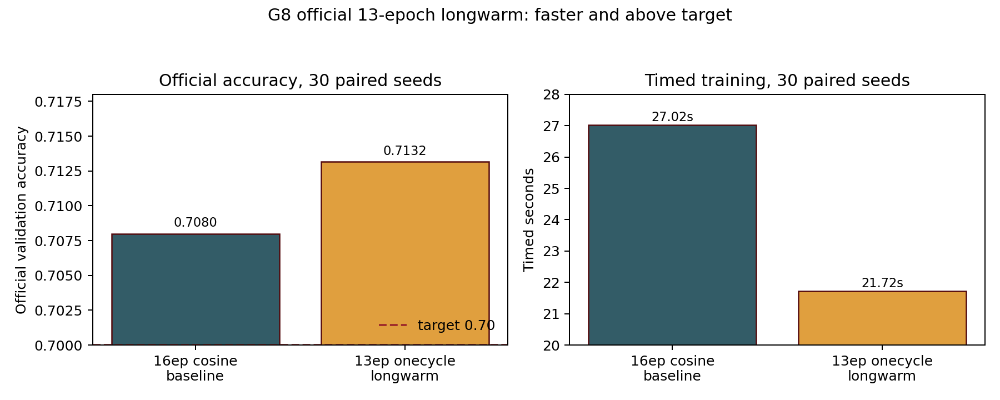

# E02 Thirteen-Epoch One-Cycle Longwarm Beats the Official CIFAR-100 Baseline

> [!summary] TL;DR
> **Thirteen-epoch one-cycle long-warmup training** keeps the official CIFAR-100 target while cutting timed training hard. It reaches ==0.7132== mean official validation accuracy and runs at `80.4%` of the 16-epoch cosine baseline; the claim is scoped to the fixed speedrun validation contract.

---

## Setup

> [!info] Constraints
> - Dataset: CIFAR-100 official train split for training and official test split as the challenge's fixed plain validation target.
> - Hardware: one Leonardo `NVIDIA A100-SXM-64GB`.
> - Scale: 30 paired seeds, base seed `880000`, alternating baseline/candidate order.
> - Metric: every candidate seed must reach official validation accuracy `>=0.70`, candidate mean official validation accuracy must be at least the paired baseline, and mean timed training seconds must be lower than the baseline.

This official run tested whether the G8 train-dev finalist, a 13-epoch one-cycle schedule with longer warmup, can replace the repository's 16-epoch cosine baseline. The candidate used `C100_EPOCHS=13`, `C100_LR_SCHEDULE=onecycle`, `C100_ONECYCLE_PCT_UP=0.40`, and `C100_ONECYCLE_DIV_FACTOR=10.0`. The baseline used the default SimpleResNet/Muon configuration with 16 epochs and cosine scheduling.

The decision criterion was strict: record mode, official validation, exactly 30 paired seeds, candidate official validation accuracy `>=0.70` on every seed, candidate mean official validation accuracy at least the paired baseline mean, all configuration differences declared, and candidate mean timed training below the baseline.

The official launch command was:

```bash
RUN_ID=g8official_13ep_onecycle_longwarm_20260703T221900Z \
RECORD=1 \
RUNS=30 \
EPOCHS=16 \
VALIDATION_SOURCE=official \
BASE_SEED=880000 \
CANDIDATE_ENV='C100_EPOCHS=13 C100_LR_SCHEDULE=onecycle C100_ONECYCLE_PCT_UP=0.40 C100_ONECYCLE_DIV_FACTOR=10.0' \
sbatch --qos=boost_qos_lprod --time=01:30:00 slurm/paired_compare.sh
```

---

## Result

| Metric | Candidate | Baseline | Delta / ratio |
| --- | :---: | :---: | :---: |
| Mean official validation accuracy | <span style="color:#335C67">**0.713153**</span> | `0.708000` | <span style="color:#335C67">`+0.005153`</span> |
| Minimum official validation accuracy | <span style="color:#335C67">**0.706600**</span> | `0.703900` | n/a |
| Target hits | <span style="color:#335C67">**30/30**</span> | `30/30` | n/a |
| Mean timed seconds | <span style="color:#335C67">**21.720387**</span> | `27.021371` | <span style="color:#335C67">`-5.300984s`</span> |
| Mean time ratio | <span style="color:#335C67">**0.804245**</span> | n/a | n/a |



`Mean official validation accuracy` is the average plain official validation accuracy over the 30 candidate or baseline seeds; higher is better. `Minimum official validation accuracy` is the worst single seed for that method. `Target hits` counts seeds at or above the challenge target. `Mean timed seconds` is the trainer-reported timed training segment after warmup and before validation; lower is better. `Mean time ratio` is candidate mean timed seconds divided by baseline mean timed seconds.

---

## Findings

### The 13-epoch schedule is a stronger official speedrun candidate

> [!important]
> The candidate is both faster and more accurate than the official 16-epoch cosine baseline across the 30-seed paired run.

The candidate was faster on every pair. Accuracy delta was positive on `25/30` pairs and negative on `5/30`, but the candidate mean official validation accuracy still improved by `+0.005153`. The minimum candidate official validation accuracy was `0.706600`, so no candidate seed fell below the challenge target.

### The result improves the schedule-compression frontier

The previous logged official finalist used 14 epochs and one-cycle scheduling. This run removes one additional timed epoch while preserving the same official validation target. It should become the new record candidate baseline for subsequent exploratory train-dev work.

---

## Caveats

> [!warning]
> This is official challenge validation evidence, not a general CIFAR-100 generalization claim. The official test split is used here because the speedrun contract defines it as the fixed validation target.

> [!warning]
> The Leonardo checkout metadata was dirty because of an unrelated untracked quarantined `orchestration/g6-official-retrain/` path. The per-run configs record code commit `2c3edb798dc27d512109a7c49eb8ede82b84c023`; the dirty path was not part of the active launcher.

The run compares against the default official 16-epoch cosine baseline. It is also faster than the previous 14-epoch official finalist in absolute timed seconds, but the primary claim here is the paired official win over the repository baseline.

---

## Next Steps

- [x] ~~Log this run as an empirical Flywheel record/finalist node~~ — node `c184a66e-6cdd-4b6b-9c23-197b0b58dd47` records the completed result.
- [ ] Use the 13-epoch one-cycle longwarm candidate as the new official record candidate baseline.
- [ ] Continue exploratory train-dev search with Muon mechanics and train-only data-path changes.
- [x] ~~Run official 30-seed paired evidence for the 13-epoch longwarm finalist~~ — the run completed and passed structural checks.

---

## Repro

The reproduction command, environment, split description, SLURM settings, seed, and hyperparameters are in `reproducibility.md`. Run code commit: `2c3edb798dc27d512109a7c49eb8ede82b84c023` on branch `codex/cifar100-speedrun-control`. Local curation commit for this logging handoff: `a122542981b04f192dbc975c516464858a643d19`.
